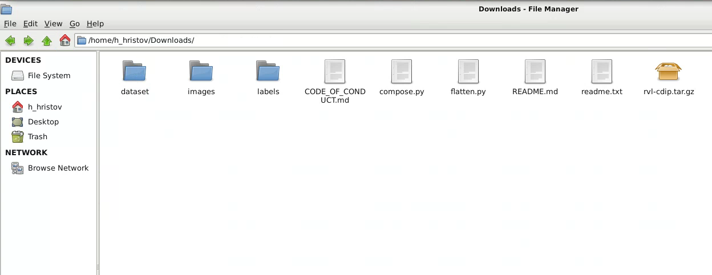

# Preprocess the RVL-CDIP dataset into a grouped by category format

The RVL-CDIP should be downloaded from the original website - https://www.cs.cmu.edu/~aharley/rvl-cdip/. Make sure you download the `labels_only.tar.gz` as well.

0. Move the 2 downloaded files in a disk space which has 80 gb free space (incl the 37gb download)

For Windows: run `tar -xvzf "./rvl-cdip.tar.gz"` 

0.5. The directory should look something like the image, without the dataset folder (that one is created automatically by this script)

1. Use the compose.py to build the per category dataset. 
`python compose.py

2. Done
